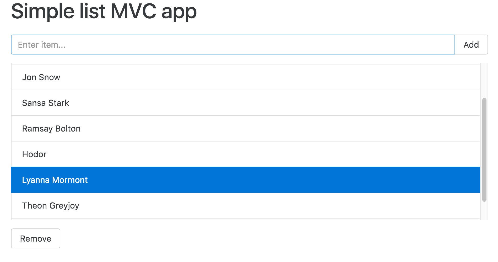

# simple-list-mvc

On my last working days at [ROAMWORKS](http://roamworks.com/our-branches/germany/), I was commanded to do some knowledge transfer sessions. During the handover process, I took a step back and tried to implement a simple list application in a more Vanilla JS fashion. :-)



### Why?
I would like to demonstrate how MVC becomes "patterns of patterns" which underlies the code base of maps module in RW app.

Since my MVC implementation is based on the MCV interpretation taken from the amazing [PJA book](http://shop.oreilly.com/product/0636920033141.do) by Eric Elliott and the awesome [design patterns online tutorials](https://caveofprogramming.com/categories/java-design-patterns/index.html) by John Purcell, I'd also like to give them credits by endorsing their works here. Honestly, they have been really inspiring, guiding me to seek the light, and influencing my programming style.

> It's all written in the book. It ain't rocket science. (:smile_cat: :book: :white_check_mark:. :see_no_evil: :rocket: :x:) –U.T.

## Installation
```sh
$ ssh git@github.com:dwiyatci/simple-list-mvc.git
$ npm run install:global
$ npm run install:clean
```

## Usage
For the sake of demo, it'd be enough to execute `npm start` from your Terminal and find the app running on http://localhost:8080.

## Author
Glenn Dwiyatcita ([@dwiyatci](http://tiny.cc/dwiyatci))

## License
WTFPL – Do What the Fuck You Want to Public License.

See [LICENSE.txt](LICENSE.txt).


